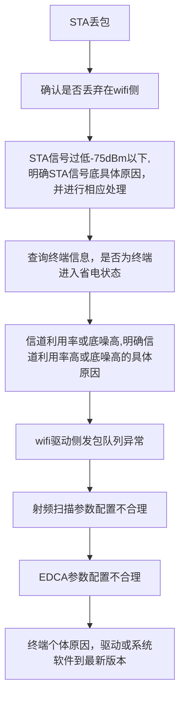

<!--more-->
## 查看路由器snmpv2信息命令：
- 执行display snmp-agent community { read | write }命令，查看当前配置的团体名。
- 执行display snmp-agent sys-info version命令，查看SNMP使能的版本信息。
- 执行display acl acl-number命令，显示配置的访问控制列表的规则。
- 执行display snmp-agent mib-view命令，查看MIB视图信息。
- 执行display snmp-agent sys-info contact命令，查看管理员的联系方式。
- 执行display snmp-agent sys-info location命令，查看路由器的位置。
- 执行display current-configuration | include trap命令，查看Trap配置信息。
- 执行display snmp-agent trap all命令，查看所有特性下所有Trap开关当前的状态和缺省状态。
- 执行display snmp-agent trap-source命令，查看发送Trap的源接口。
- 执行display snmp-agent target-host命令，查看目标主机的信息。
- 执行display snmp-agent extend error-code status命令，查看设备向网管发送扩展错误码的功能是否使能。
- 执行display station all 查看sta接入的终端及对应ssid
## 丢包排查思路

开启station-trace功能，进行ping包测试
```
station-trace sta-mac 482c-a042-8227 
```
通过命令查询终端相关信息
```
display station sta-mac 8844-7748-3c81
```
查询用户当前接入的ap对应的射频信道利用率以及底噪情况。
```
display ap traffic statistics wireless ap-id 19 radio 1
Wireless noise(dBm)                                   :-104  //底噪
Wireless port up rate(Kbps)                           :0     //射频口上行流量
Wireless port down rate(Kbps)                         :0     //射频口下行流量
 Wireless channel utilization(%)                       :84    //信道利用率
```
查看导致ap信道利用率高的原因
```
V200R019C10及之后版本：
[AP-diagnose] display lmac base-info radio 1
 ......
 ChannelUtilizationRate(%)  : 3        //信道利用率
CoChanInterferenceRate(%)  : 3        //同频干扰率
V200R006C20~V200R019C00版本：
<AP> system-view
 [AP] diagnose
 [AP-diagnose] display wifi base-info radio 0
 ......
 ChanUtilizationRate(%)    = 80  //信道利用率
CoChanInterferenceRate(%) = 10  //干扰率
......
 V200R005以及V200R006C10版本：
<AP> system-view
 [AP] diagnose
 [AP-diagnose] display interface radio 0
 ......
 ChanUtilizationRate(%)    = 80  //信道利用率
CoChanInterferenceRate(%) = 10  //干扰率
如果信道利用率很高，但是干扰率并不大，如上面显示，说明信道利用率高
主要由于本AP导致；如果信道利用率很高，干扰率也很高，则说明信道利用
率高是由于干扰导致。
```
查看射频上、下行流量
```
 display ap traffic statistics wireless ap-id 19 radio 1
 ......
 Wireless port up rate(Kbps)                           :311112
 Wireless port down rate(Kbps)                         :402245
```
查看是否存在大量组播或广播报文通过ap发送到空口
```
V200R019C10及之后版本：
[AP-diagnose] display lmac radio-tx-statistics radio 1
 Tx stats:
 ......
 Multicast packets                  : 54
 Broadcast packets                  : 27
 V200R006C20~V200R019C00版本：
<AP> system-view
 [AP] diagnose
 [AP-diagnose] display wifi radio-statistics radio 1
 ......
  Broadcast Pkt Num         : 323212
  Multicast Pkt Num         : 234223
 ......
 V200R005以及V200R006C10版本：
<AP> system-view
 [AP] diagnose
 [AP-diagnose] display radio-statistics radio 1
 ......
  Broadcast Pkt Num         : 323212
  Multicast Pkt Num         : 234223
由于组播或者广播报文，默
认都是以低物理层速率（2.4G：11Mbps，5G：6Mbps）进行发送，因此报
文过多将会导致空口带宽耗尽，进而影响到普通的单播数据业务。
```
查看低速或低rssi用户
```
<AC> display station ap 19
 Rf/WLAN: Radio ID/WLAN ID
 Rx/Tx: link receive rate/link transmit rate(Mbps)
-----------------------------------------------------------------------------------------------
STA MAC          Rf/WLAN  Band  Type  Rx/Tx      RSSI  VLAN  IP address      SSID
-----------------------------------------------------------------------------------------------
8844-7748-3c81   1/1      5G    11ac  39/52      -64   1     192.168.150.162 m0_tes
-----------------------------------------------------------------------------------------------
Total: 1 2.4G: 0 5G: 1
查看终端流量统计
<AC> display station statistics sta-mac 8844-7748-3c81
----------------------------------------------------------------
  Packets sent to the station                           : 11234
  Packets received from the station                     : 23423
  Bytes sent to the station                             : 123434
  Bytes received from the station                       : 323444
  Wireless data rate sent to the station(kbps)          : 4320
  Wireless data rate received from the station(kbps)    : 4599
  Trigger roam total                                    : 0
  Trigger roam failed                                   : 0
  STA power save percent                                : 0%
--------------------------------------------------------------------
上面显示的Rx表示STA发包给AP采用的物理层速率，Tx表示AP发包给STA采
用的物理层速率。Rx/Tx速率均会随着报文在空口的传送情况（重传或极限重
传丢包）进行自适应变化。传送相同的流量，物理层速率越低占用的空口带
宽将会越大，比如某STA发给AP报文采用的物理层速率在13Mbps左右，此时
传输5Mbps的流量就基本上会将空口带宽耗尽，导致信道利用率很高，影响
同射频下其他STA正常业务。
```
查看是否由于AP cpu利用率高导致丢包
```
<AC> display ap performance statistics ap-id 15
 ......
 CPU usage(%)                    : 80
 ......
```
查看ap射频下的发包队列是否正常
```
<AP> system-view 
[AP] diagnose 
[AP-diagnose] display interface radio 0 txq-buf 
[txqbuf] 
  ath_softc free buf:1024 
  tx queue depth    :1024 
  txq 0:buf_used = 0   minfree = 48   aggr_depth = 0   axq_depth = 0 
  txq 1:buf_used = 0   minfree = 32   aggr_depth = 0   axq_depth = 0 
  txq 2:buf_used = 0   minfree = 16   aggr_depth = 0   axq_depth = 0 
重点观察Txq 0 、1、2 、3 、7 以及8等6个队列的buffer使用情况，正常情
况下buf_used值都是比较小的，当存在大业务量，比如下载时，个别队列的
buf_used值会增加到比较大的值，比如达到500。当存在低建链速率用户下
载或大量组播/广播报文时，可能会更高，由于buffer是射频下所有用户共享
的，当被某个用户占用太多时，会导致其他用户无法及时申请到buffer，导
致丢包或时延大.
对于带有11ac芯片款型AP，如AP5030DN（5G射频）、AP7050DE、
AP4050DN等：
[AP-diagnose] display wifi txq-buf radio 1 
[Txqbuf]
  Host tx queue depth:2500
 [Frames queued to hwq]
  -------------------------------------
  Q0  Q1  Q2  Q3  Q4  Q5  Q6  Q7  Q8  Q9
  0   0   0   0   0   0   0   0   0   0
  -------------------------------------
[Tid queue stats]
  SW queue stats <---> HW queue stats
  -----------------------------
  TID 0     0               0
  TID 1     0               0
  TID 2     0               0
  TID 3     0               0
  TID 4     0               0
  TID 5     0               0
  TID 6     0               0
  TID 7     0               0
  TID 8     0               0
  TID 9     0               0
  TID 10    0               0
  TID 11    0               0
  TID 12    0               0
  TID 13    0               0
  TID 14    0               0
  TID 15    0               0
  TID 16    0               0
  TID 17    0               0
  TID 18    0               0
  TID 19    0               0
  -----------------------------
[Prefetch Tx queue stats]         //该项只有支持11ac Wave2款型的AP存在，如AP7050DE/
 AP6050DN/AP4050DN等-----------------------------
  TID 0     0
重点观察TID 0、1、2、3、16以及17等6个队列的SW queue stats 值，一般
情况下值也都比较小。
正常情况下，每个队列的buffer使用个数均是在动态变化的，会随着业务量
的增加而变大，业务量的降低而减小
对于V200R019C10版本11ax芯片款型AP：
[AP-diagnose] display lmac txq-buf radio 1
 Hardware tx queue statistic:
-----------------------------------------------------------------
        Txq0  Txq1  Txq2   Txq3   Txq4   Txq5   Txq6   Txq7
 Total   0     0     0      0      0      0      0      0
-----------------------------------------------------------------
        Txq8  Txq9  Txq10  Txq11  Txq12  Txq13  Txq14  Txq15
 Total   0     0     0      0      0      0      0      0
-----------------------------------------------------------------
Software tid queue statistic:
-----------------------------------------------------------------
        Tid0   Tid1   Tid2   Tid3   Tid4
 Total   0      0      0      0      0
-----------------------------------------------------------------
        Tid5   Tid6   Tid7   Tid8   Tid9
 Total   0      0      0      0      0
-----------------------------------------------------------------
Qos queue statistic:
-----------------------------------------------------------------
       BE     BK     VI     VO
 Total  0      0      0      0
-----------------------------------------------------------------
当出现整个射频下几乎没有业务量，信道利用率也处于正常水平，但是buffer使用
个数一直很高（多次查询该命令发现始终很高，比如超过800），且业务丢包严
重，此时需要确认下具体是哪个用户占用了buffer，可能该用户状态出现了问题。
display lmac sta-statistics queue-status sta d453-83e1-1bea
查看
```

## 配置snmpv1
[官方文档](https://support.huawei.com/enterprise/zh/doc/EDOC1100332363/b7ca8f82)
[案例](https://support.huawei.com/enterprise/zh/doc/EDOC1100332363/d3a64a86)
## 配置snmpv2
[官方文档](https://support.huawei.com/enterprise/zh/doc/EDOC1100332363/40dfdfef)
[案例](https://support.huawei.com/enterprise/zh/doc/EDOC1100332363/43195717)
## 配置snmpv3
[官方文档](https://support.huawei.com/enterprise/zh/doc/EDOC1100332363/82912919)
[案例](https://support.huawei.com/enterprise/zh/doc/EDOC1100332363/341e6781)
## 检查配置结果
[官方文档](https://support.huawei.com/enterprise/zh/doc/EDOC1100332363/6244c007)

# 参考
华为 软件故障定位指南