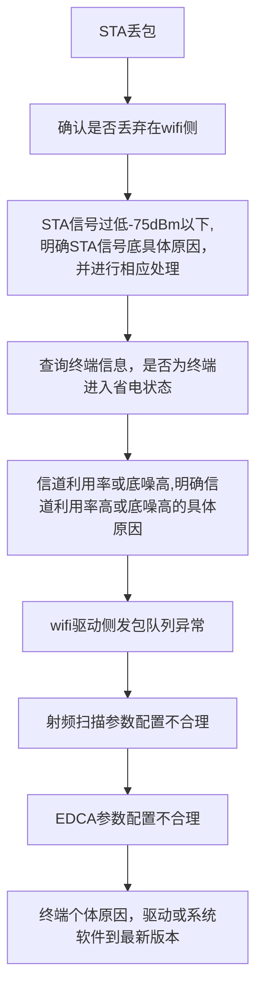

<!--more-->
## 查看路由器snmpv2信息命令：
- 执行display snmp-agent community { read | write }命令，查看当前配置的团体名。
- 执行display snmp-agent sys-info version命令，查看SNMP使能的版本信息。
- 执行display acl acl-number命令，显示配置的访问控制列表的规则。
- 执行display snmp-agent mib-view命令，查看MIB视图信息。
- 执行display snmp-agent sys-info contact命令，查看管理员的联系方式。
- 执行display snmp-agent sys-info location命令，查看路由器的位置。
- 执行display current-configuration | include trap命令，查看Trap配置信息。
- 执行display snmp-agent trap all命令，查看所有特性下所有Trap开关当前的状态和缺省状态。
- 执行display snmp-agent trap-source命令，查看发送Trap的源接口。
- 执行display snmp-agent target-host命令，查看目标主机的信息。
- 执行display snmp-agent extend error-code status命令，查看设备向网管发送扩展错误码的功能是否使能。
- 执行display station all 查看sta接入的终端及对应ssid
## 丢包排查思路

开启station-trace功能，进行ping包测试
```
station-trace sta-mac 482c-a042-8227 
```
通过命令查询终端相关信息
```
display station sta-mac 8844-7748-3c81
```
查询用户当前接入的ap对应的射频信道利用率以及底噪情况。
```
display ap traffic statistics wireless ap-id 19 radio 1
Wireless noise(dBm)                                   :-104  //底噪
Wireless port up rate(Kbps)                           :0     //射频口上行流量
Wireless port down rate(Kbps)                         :0     //射频口下行流量
 Wireless channel utilization(%)                       :84    //信道利用率
```
查看导致ap信道利用率高的原因
```
V200R019C10及之后版本：
[AP-diagnose] display lmac base-info radio 1
 ......
 ChannelUtilizationRate(%)  : 3        //信道利用率
CoChanInterferenceRate(%)  : 3        //同频干扰率
V200R006C20~V200R019C00版本：
<AP> system-view
 [AP] diagnose
 [AP-diagnose] display wifi base-info radio 0
 ......
 ChanUtilizationRate(%)    = 80  //信道利用率
CoChanInterferenceRate(%) = 10  //干扰率
......
 V200R005以及V200R006C10版本：
<AP> system-view
 [AP] diagnose
 [AP-diagnose] display interface radio 0
 ......
 ChanUtilizationRate(%)    = 80  //信道利用率
CoChanInterferenceRate(%) = 10  //干扰率
如果信道利用率很高，但是干扰率并不大，如上面显示，说明信道利用率高
主要由于本AP导致；如果信道利用率很高，干扰率也很高，则说明信道利用
率高是由于干扰导致。
```
查看射频上、下行流量
```
 display ap traffic statistics wireless ap-id 19 radio 1
 ......
 Wireless port up rate(Kbps)                           :311112
 Wireless port down rate(Kbps)                         :402245
```
查看是否存在大量组播或广播报文通过ap发送到空口
```
V200R019C10及之后版本：
[AP-diagnose] display lmac radio-tx-statistics radio 1
 Tx stats:
 ......
 Multicast packets                  : 54
 Broadcast packets                  : 27
 V200R006C20~V200R019C00版本：
<AP> system-view
 [AP] diagnose
 [AP-diagnose] display wifi radio-statistics radio 1
 ......
  Broadcast Pkt Num         : 323212
  Multicast Pkt Num         : 234223
 ......
 V200R005以及V200R006C10版本：
<AP> system-view
 [AP] diagnose
 [AP-diagnose] display radio-statistics radio 1
 ......
  Broadcast Pkt Num         : 323212
  Multicast Pkt Num         : 234223
由于组播或者广播报文，默
认都是以低物理层速率（2.4G：11Mbps，5G：6Mbps）进行发送，因此报
文过多将会导致空口带宽耗尽，进而影响到普通的单播数据业务。
```
查看低速或低rssi用户
```
<AC> display station ap 19
 Rf/WLAN: Radio ID/WLAN ID
 Rx/Tx: link receive rate/link transmit rate(Mbps)
-----------------------------------------------------------------------------------------------
STA MAC          Rf/WLAN  Band  Type  Rx/Tx      RSSI  VLAN  IP address      SSID
-----------------------------------------------------------------------------------------------
8844-7748-3c81   1/1      5G    11ac  39/52      -64   1     192.168.150.162 m0_tes
-----------------------------------------------------------------------------------------------
Total: 1 2.4G: 0 5G: 1
查看终端流量统计
<AC> display station statistics sta-mac 8844-7748-3c81
----------------------------------------------------------------
  Packets sent to the station                           : 11234
  Packets received from the station                     : 23423
  Bytes sent to the station                             : 123434
  Bytes received from the station                       : 323444
  Wireless data rate sent to the station(kbps)          : 4320
  Wireless data rate received from the station(kbps)    : 4599
  Trigger roam total                                    : 0
  Trigger roam failed                                   : 0
  STA power save percent                                : 0%
--------------------------------------------------------------------
上面显示的Rx表示STA发包给AP采用的物理层速率，Tx表示AP发包给STA采
用的物理层速率。Rx/Tx速率均会随着报文在空口的传送情况（重传或极限重
传丢包）进行自适应变化。传送相同的流量，物理层速率越低占用的空口带
宽将会越大，比如某STA发给AP报文采用的物理层速率在13Mbps左右，此时
传输5Mbps的流量就基本上会将空口带宽耗尽，导致信道利用率很高，影响
同射频下其他STA正常业务。
```
查看是否由于AP cpu利用率高导致丢包
```
<AC> display ap performance statistics ap-id 15
 ......
 CPU usage(%)                    : 80
 ......
```
查看ap射频下的发包队列是否正常
```
<AP> system-view 
[AP] diagnose 
[AP-diagnose] display interface radio 0 txq-buf 
[txqbuf] 
  ath_softc free buf:1024 
  tx queue depth    :1024 
  txq 0:buf_used = 0   minfree = 48   aggr_depth = 0   axq_depth = 0 
  txq 1:buf_used = 0   minfree = 32   aggr_depth = 0   axq_depth = 0 
  txq 2:buf_used = 0   minfree = 16   aggr_depth = 0   axq_depth = 0 
重点观察Txq 0 、1、2 、3 、7 以及8等6个队列的buffer使用情况，正常情
况下buf_used值都是比较小的，当存在大业务量，比如下载时，个别队列的
buf_used值会增加到比较大的值，比如达到500。当存在低建链速率用户下
载或大量组播/广播报文时，可能会更高，由于buffer是射频下所有用户共享
的，当被某个用户占用太多时，会导致其他用户无法及时申请到buffer，导
致丢包或时延大.
对于带有11ac芯片款型AP，如AP5030DN（5G射频）、AP7050DE、
AP4050DN等：
[AP-diagnose] display wifi txq-buf radio 1 
[Txqbuf]
  Host tx queue depth:2500
 [Frames queued to hwq]
  -------------------------------------
  Q0  Q1  Q2  Q3  Q4  Q5  Q6  Q7  Q8  Q9
  0   0   0   0   0   0   0   0   0   0
  -------------------------------------
[Tid queue stats]
  SW queue stats <---> HW queue stats
  -----------------------------
  TID 0     0               0
  TID 1     0               0
  TID 2     0               0
  TID 3     0               0
  TID 4     0               0
  TID 5     0               0
  TID 6     0               0
  TID 7     0               0
  TID 8     0               0
  TID 9     0               0
  TID 10    0               0
  TID 11    0               0
  TID 12    0               0
  TID 13    0               0
  TID 14    0               0
  TID 15    0               0
  TID 16    0               0
  TID 17    0               0
  TID 18    0               0
  TID 19    0               0
  -----------------------------
[Prefetch Tx queue stats]         //该项只有支持11ac Wave2款型的AP存在，如AP7050DE/
 AP6050DN/AP4050DN等-----------------------------
  TID 0     0
重点观察TID 0、1、2、3、16以及17等6个队列的SW queue stats 值，一般
情况下值也都比较小。
正常情况下，每个队列的buffer使用个数均是在动态变化的，会随着业务量
的增加而变大，业务量的降低而减小
对于V200R019C10版本11ax芯片款型AP：
[AP-diagnose] display lmac txq-buf radio 1
 Hardware tx queue statistic:
-----------------------------------------------------------------
        Txq0  Txq1  Txq2   Txq3   Txq4   Txq5   Txq6   Txq7
 Total   0     0     0      0      0      0      0      0
-----------------------------------------------------------------
        Txq8  Txq9  Txq10  Txq11  Txq12  Txq13  Txq14  Txq15
 Total   0     0     0      0      0      0      0      0
-----------------------------------------------------------------
Software tid queue statistic:
-----------------------------------------------------------------
        Tid0   Tid1   Tid2   Tid3   Tid4
 Total   0      0      0      0      0
-----------------------------------------------------------------
        Tid5   Tid6   Tid7   Tid8   Tid9
 Total   0      0      0      0      0
-----------------------------------------------------------------
Qos queue statistic:
-----------------------------------------------------------------
       BE     BK     VI     VO
 Total  0      0      0      0
-----------------------------------------------------------------
当出现整个射频下几乎没有业务量，信道利用率也处于正常水平，但是buffer使用
个数一直很高（多次查询该命令发现始终很高，比如超过800），且业务丢包严
重，此时需要确认下具体是哪个用户占用了buffer，可能该用户状态出现了问题。
display lmac sta-statistics queue-status sta d453-83e1-1bea
查看
```

## 常用查看wifi情况命令
```
display ap traffic statistics wireless ap-id 0 radio 1  查看ap 0 发射器1，查询ap的信道利用率大于50%，信道利用率比较高，空口干扰比较大： 
Wireless channel utilization(%)  :2
Wireless noise(dBm)                                   :-104  //底噪
Wireless port up rate(Kbps)                           :0     //射频口上行流量
Wireless port down rate(Kbps)                         :0     //射频口下行流量


display station all   查看终端的RSSI和协商速率。  display station all | include mac-address 查看具体sta 协商速率
display station sta-mac 8038-FB18-D92C  查看终端关联后的射频模式、AP配置的加密方式、终端支持的空间流、配置的频宽都与协商速率
Station's radio mode                      : 11n
Station's Authentication Method           : WPA2-PSK
Station's Cipher Type                     : AES 
Station's Channel Band-width              : 20MHz 
Station's QoS Mode                        : WMM 
Station's HT Mode                         : HT20 
Station's MCS value                       : 15 
Station's NSS value                       : 2
Station's Short GI                        : nonsupport  

display station sta-mac 482c-a042-8227  检查终端是否处在节电状态                 
Power save mode enabled                 :YES    

display radio ap-id 0    ac 查看ap信道利用率判断空口干扰程度。

display ap performance statistics ap-id 0  查看ap情况， cpu memory 温度 传输流量 情况
display ap neighbor ap-id 0 查看 ap 周围信道及强度
display station ap-name f4b7-8d4f-47e0  查看 ap下所有sta情况
display radio all   查看 所有 ap 信道利用率情况
display radio-5g-profile all  查看5g模板
display air-scan-profile name default 查看模板名为default的模板内容
display ip pool interface Vlanif1 查看ip池分配情况

display smart-policy-route load-balance-mode select-path-result，查看负载分担模式下流量的选路结果。
display smart-policy-route physical-interface，查看物理接口的相关信息。

AC-BE: 尽力而为流量队列
AC-BK：后台流量队列
Wireless frames(RX): 无线侧接收空口数据帧和管理帧总数
Wireless bytes(RX): 无线侧接收空口数据帧的字节总数
Wireless error frames(RX): 无线侧接收的错误帧的总数
Wireless physical layer error frames(RX): 无线侧接收物理层错误帧数。
Wireless MIC error frames(RX): 无线侧接收MIC错误帧数。
Wireless private key and decrypt fail frames(RX): 无线侧接收KEY解密失败错误帧数。
Wireless unicast frames(RX): 接收的单播帧的总数
Wireless management frames(RX): 无线侧接收管理帧数。
Wireless data frames(RX): 无线侧接收数据帧数。
Wireless frames(TX): 发送的帧的总数
Wireless bytes(TX): 线侧发送空口数据帧的字节总数
Wireless RTS successes(TX): 无线侧发送成功RTS帧数。
Wireless unicast frames(TX): 发送的单播帧的总数
Wireless broadcast frames(TX): 无线侧发送广播帧数。
Wireless failure frames(TX): 无线侧发送失败帧数。
Wireless management frames(TX): 无线侧发送管理帧数。
Wireless data frames(TX): 无线侧发送数据帧数。
Wireless noise(dBm): 无线侧的噪声值(dBm)。
Wireless port up rate(Kbps): 无线侧上行速率(Kbps)。
Wireless port down rate(Kbps): 无线侧下行速率(Kbps)。
Wireless port PS-Poll Frames: 终端station处于省电模式时发送的帧数。
Wireless port Association Request: 关联请求帧数。
Wireless port Association Response: 关联响应帧数。
Wireless port ReAssociation Request: 重关联请求帧数。
Wireless port ReAssociation Response: 重关联响应帧数。
Wireless port Disassociation Frames: 去关联帧数。
Wireless port Deauthentication Frames: 去认证帧数。
Wireless retry frames: 无线侧重传帧数。
Wireless PER(%): 无线侧误包率。
Wireless PER of the last 5min(%): 无线侧在上一个统计周期内的误包率。
Wireless port drop rate(%): 无线侧软件丢包率。
Wireless port drop rate of the last 5min(%): 无线侧在上一个周期内的软件丢包率。
Wireless retransmitted rate(%): 无线侧重传率。
Wireless retransmitted rate of the last 5min(%): 无线侧在上一个周期内的重传率。
Wireless channel utilization(%): 无线侧信道利用率。
WMM AC_BE retry ratio(%): WMM队列中AC_BE类别报文的重传率。
WMM AC_BK retry ratio(%): WMM队列中AC_BK类别报文的重传率。
WMM AC_VI retry ratio(%): WMM队列中AC_VI类别报文的重传率。
WMM AC_VO retry ratio(%): WMM队列中AC_VO类别报文的重传率。
WMM AC_BE PER(%): WMM队列中AC_BE类别报文的丢包率。
WMM AC_BK PER(%): WMM队列中AC_BK类别报文的丢包率。
WMM AC_VI PER(%): WMM队列中AC_VI类别报文的丢包率。
WMM AC_VO PER(%): WMM队列中AC_VO类别报文的丢包率。

- 如果信道利用率超过60%，且干扰率较高，说明空口干扰比较严重，可以尝试通过调整信道和功率的方式来解决。
- 如果底噪高于-80dBm，建议切换信道，切到一个底噪较低的信道，切信道时注意兼顾信道利用率和干扰率。
- 报文重传率较高（高于20%），说明空口碰撞较大，建议配置RTS-CTS的工作模式为rts-cts模式，减少空口报文的碰撞。，比如某STA发给AP报文采用的物理层速率在13Mbps左右，此时传输5Mbps的流量就基本上会将空口带宽耗尽，导致信道利用率很高，影响同射频下其他STA正常业务。一般低速率用户都会伴随着低信号强度。
- 扫描参数主要涉及扫描间隔以及扫描持续时间，如果配置不合理，比如扫描间隔配置的很短（低于3s）或扫描持续时间配置的较大（如100ms），由于AP频繁切换到非工作信道进行信息收集，会导致工作信道上的用户业务受损，表现为丢包或时延大。
```

## 拿命填坑：
设置snmp需要配置server-source为Loopback，必须设置，否则没有响应。设置了interface 作为源，不知道是不是清理密码干掉了，总之无法成功访问，无意间看到有server-source 配置为loopback的文档，验证，有响应了。
```
<Huawei> system-view
[Huawei] interface Loopback 0
[Huawei] ip address 192.168.30.5 32
[Huawei] quit
[Huawei] snmp-agent 
[Huawei] snmp-agent sys-info version v2c
[Huawei] snmp-agent mib-view dnsmib include 1.3.6.1.4.1.2011.5.25.194
[Huawei] snmp-agent server-source -i loopback 0
```

## 非等价负载分担功能
```
system-view
interface interface-type interface-number [.subinterface-number ] 
load-balance bandwidth bandwidth，手动配置当前接口的带宽。
load-balance unequal-cost enable，使能当前接口非等价负载分担功能。
shutdown，关闭当前接口。
undo shutdown，开启当前接口。
quit，退出接口视图
只有当所有等价链路的出接口都使能UCMP功能，且触发了FIB表项重新下发（先后执行命令shutdown和undo shutdown）后，各等价链路才在设备上进行非等价负载分担。如果其中任一接口没有使能UCMP功能，即使触发了FIB表项重新下发，各等价链路仍进行等价负载分担。
display pppoe-client session summary   查看pppoe会话状态和配置信息
display ip routing-table protocol static    查看配置的静态路由表信息
```
[配置非等价负载分担功能](https://support.huawei.com/enterprise/zh/doc/EDOC1100320897/f19d5a22)

## 配置ap命令
```
执行命令system-view，进入系统视图。
执行命令wlan ac，进入WLAN视图。
执行命令regulatory-domain-profile name profile-name，创建域管理模板，并进入模板视图。
缺省情况下，系统上存在名为default的域管理模板。

执行命令country-code country-code，配置国家码。
缺省情况下，设备的国家码标识为“CN”。
关于国家码和国家的对应关系表请参见country-code。
在域模板下修改国家码后，会自动重启使用了该域模板的AP。

执行命令quit，返回WLAN视图。
在AP组或AP上引用域管理模板。
在AP组中引用域管理模板。
执行命令ap-group name group-name，进入AP组视图。
执行命令regulatory-domain-profile profile-name，在AP组中引用域管理模板。
缺省情况下，AP组中引用了名为default的域管理模板。

在AP上引用域管理模板。
执行命令ap-id ap-id、ap-mac ap-mac或ap-name ap-name，进入AP视图。
执行命令regulatory-domain-profile profile-name，在AP上引用域管理模板。
缺省情况下，AP上未引用域管理模板。

执行命令quit，返回WLAN视图。
执行命令commit { all | ap-name ap-name | ap-id { ap-id1 [ to ap-id2 ] } &<1-10> }，下发配置到AP。

执行命令display regulatory-domain-profile { all | name profile-name }，查看域管理模板的配置信息。
执行命令display references regulatory-domain-profile name profile-name，查看域管理模板的引用信息。
执行命令display capwap configuration，查看AC的源接口。
执行命令display ac global configuration，查看AC的全局配置信息，即AC的网元名称。
执行命令display ap all，查看AP的上线结果
```
### 配置射频参数
为避免信号干扰，使AP工作在更佳状态，提高WLAN网络质量，可以手动配置相邻AP工作在非重叠信道上。
display ap configurable channel { ap-name ap-name | ap-id ap-id }查看指定AP支持的可配置的信道。
2.4G 20M : 1,2,3,4,5,6,7,8,9,10,11,12,13.
2.4G 40M+: 1,2,3,4,5,6,7.
2.4G 40M-: 5,6,7,8,9,10,11.
5G   20M : 36,40,44,48,52,56,60,64,149,153,157,161,165.
5G   40M+: 36,44,52,60,149,157.
5G   40M-: 40,48,56,64,153,161.
5G   80M : 36,40,44,48,52,56,60,64,149,153,157,161.

执行命令display radio-2g-profile { all | name profile-name }，查看2G射频模板的配置信息和引用信息。
执行命令display radio-5g-profile { all | name profile-name }，查看5G射频模板的配置信息和引用信息。
执行命令display references radio-2g-profile name profile-name，查看2G射频模板的引用信息。
执行命令display references radio-5g-profile name profile-name，查看5G射频模板的引用信息。
执行命令display ap configurable channel { ap-name ap-name | ap-id ap-id }，查看指定AP支持的可配置信道。
执行命令display ap config-info { ap-name ap-name | ap-id ap-id }，查看AP的配置信息。

### 检测无线链路质量
执行命令system-view，进入系统视图。
执行命令wlan ac，进入WLAN视图。
执行命令rf-ping [ -m time | -c number ] * mac-address，主动探测无线链路质量。
执行命令system-view，进入系统视图。
执行命令wlan ac，进入WLAN视图。
执行命令ap-ping { ap-name ap-name | ap-id ap-id } [ -c count | -s packetsize | -m time | -t timeout ] * host，配置AP设备去Ping一个网络设备，检测从AP到指定网络设备之间的网络是否连通。

[射频参数配置](https://support.huawei.com/enterprise/zh/doc/EDOC1100320912/4c91cb23)
[射频调优](https://support.huawei.com/enterprise/zh/doc/EDOC1100320912/b595aeb#ZH-CN_TASK_0177875460)
[检测ap与sta的无线质量](https://support.huawei.com/enterprise/zh/doc/EDOC1100320912/dfe85e4a)
[检测ap与网络设备的连通性](https://support.huawei.com/enterprise/zh/doc/EDOC1100320912/418ccbe9)
[维护ap统计信息](https://support.huawei.com/enterprise/zh/doc/EDOC1100320912/368bfb7f)
[维护sta统计信息](https://support.huawei.com/enterprise/zh/doc/EDOC1100320912/2f777213)

[配置ap上线](https://support.huawei.com/enterprise/zh/doc/EDOC1100320912/67bc98e0)

## 配置snmpv1
[官方文档](https://support.huawei.com/enterprise/zh/doc/EDOC1100332363/b7ca8f82)
[案例](https://support.huawei.com/enterprise/zh/doc/EDOC1100332363/d3a64a86)
## 配置snmpv2
[官方文档](https://support.huawei.com/enterprise/zh/doc/EDOC1100332363/40dfdfef?idPath=24030814|21782164|7923148|256863201)
[案例](https://support.huawei.com/enterprise/zh/doc/EDOC1100332363/43195717)

## 配置snmpv3
[官方文档](https://support.huawei.com/enterprise/zh/doc/EDOC1100332363/82912919)
[案例](https://support.huawei.com/enterprise/zh/doc/EDOC1100332363/341e6781)
## 检查配置结果
[官方文档](https://support.huawei.com/enterprise/zh/doc/EDOC1100332363/6244c007)

# 参考
华为 软件故障定位指南
[snmp配置命令](https://support.huawei.com/enterprise/zh/doc/EDOC1100271770/dab469bd#ZH-CN_CLIREF_0177886580)