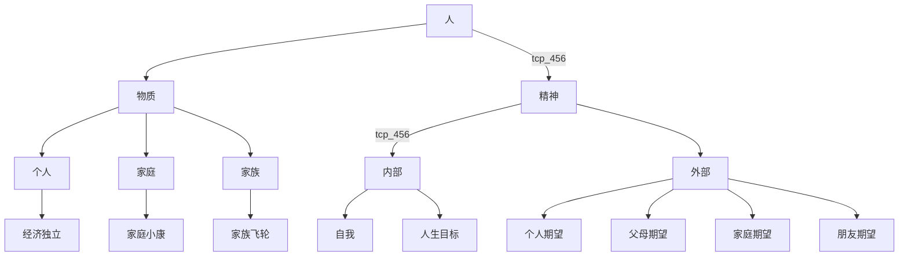

<!--more-->
## 对一个人的构成思考
定义： 目前普适定义为“人类”，人类这一物种的简化。  

纵向维度:
1. 一级成长曲线(作为主线)
2. 二级成长曲线(作为次级补充)
在当今社会中，人有以下属性：
1. 人生目标:
    - 5年愿景
    - 年目标
    - 月目标
    - 周任务
2. 物质条件：
    - 家庭
    - 财富
    - 
3. 关注内、外部的程度（以个体为分界，一体两面，过分关注自己会耗费大量注意力，于是减少了对外部的观察，反向同理）:
    - 内部:
        1. 关注“内部”，对自己更严格。
    - 外部:
        1. 关注"外部"，都是世界的问题。

